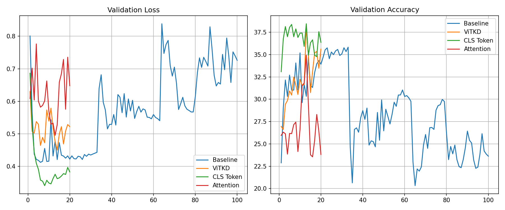

# Knowledge Distillation for ViTs

Transferring representational power from a frozen **ViT-Large** (Teacher) to a lightweight **ViT-Tiny** (Student) on the **Oxford-IIIT Pet** dataset.

## Results Summary

| Strategy / Run | Epochs | Val Top-1 | Val Loss | Key Note |
| :--- | :---: | :---: | :---: | :--- |
| **Baseline (No Teacher)** | 100 | 35.83% | 0.6332 | Overfit |
| **ViTKD (Patch Feature KD)** | 20 | 38.09% | 0.5220 | Strong spatial transfer |
| **CLS Token Distillation** | **20** | **38.45%** | **0.3826** | **Best performance & stability** |
| **Attention Transfer KD** | 20 | 34.92% | 0.6478 | Overly restrictive |

---

## What We Did
We trained our ViT-Tiny student model using three different distillation techniques for only **20 epochs** each (compared to the **100-epoch** baseline):

1. **Baseline**: Trained ViT-Tiny alone from scratch (took 100 epochs, overfit severely).
2. **ViTKD**: Aligned the spatial patch embeddings of the student and teacher using Mean Squared Error (MSE).
3. **CLS Token KD**: Aligned only the classification `[CLS]` token (global summary) between student and teacher.
4. **Attention Transfer**: Forced the student to mimic the teacher's self-attention patterns.

---

## Quick Insights (In Simple Words)
* **Why did distillation work?** Tiny models easily overfit when trained alone. A larger teacher provides "soft guides" (semantic relationships) that regularize the student and help it learn much faster (in just 20 epochs vs 100).
* **Why did CLS Token KD win?** The `[CLS]` token holds the ultimate summary of the image. Teaching the student to match this summary is simple and highly effective.
* **Why did Attention Transfer struggle?** A tiny model doesn't have the capacity to mimic the highly complex attention patterns of a massive teacher.

---

## References
* [DeiT Paper](https://arxiv.org/pdf/2012.12877)
* [Relational KD](https://arxiv.org/pdf/1904.05068)
* [ViTKD Paper](https://openaccess.thecvf.com/content/CVPR2024W/PBDL/papers/Yang_ViTKD_Feature-based_Knowledge_Distillation_for_Vision_Transformers_CVPRW_2024_paper.pdf)